# Pyxis Marine Tactical System — Architecture v4.1.1

```mermaid
graph TD
    subgraph EXTERNAL_OSINT ["⬛ OSINT Data Sources"]
        direction TB
        GDELT["🌐 GDELT Project\nMaritime/Naval News\n(every 30 min)"]
        FIRMS["🛰️ NASA FIRMS\nThermal / Fire Anomalies\n(every 30 min)"]
        GDACS["🌀 GDACS API\nGlobal Disaster Alerts\nOrange/Red Events\n(every 10 min)"]
        GMDSS["📡 NGA GMDSS\nNavigation Warnings\nBroadcast (every hr)"]
        ASAM["☠️ NGA ASAM\nAnti-Shipping Activity\nPiracy Incidents (every hr)"]
        NTM["📋 NGA MSI\nNotice to Mariners\n(every hr)"]
    end

    subgraph EXTERNAL_SENSOR ["🌊 Marine & Environmental"]
        direction TB
        AIS["🚢 AISStream/OpenMarine\nLive AIS Vessel Contacts\n(WebSocket)"]
        OSM["🗺️ OpenSeaMap / Overpass\nSeamarks, Shoals, Reefs\n(on vessel move > 5nm)"]
        METEO["🌊 Open-Meteo Marine API\nWave Height/Dir/Period\nCurrent Velocity (30 min)"]
        ETOPO["📊 ETOPO1 Bathymetry\nSeafloor Depth (30 min)"]
        RAINV["🌧️ RainViewer API\nWeather Radar Tiles"]
        NOAASWPC["☀️ NOAA SWPC\nPlanetary K-Index\nSpace Weather (every hr)"]
        USGS["🌍 USGS\nEarthquake/Seismic Feed\n(every 15 min)"]
    end

    subgraph EXTERNAL_GEO ["🌐 Geospatial Services"]
        direction TB
        SUNAPI["🌅 Sunrise-Sunset API\nLocal Sunrise/Sunset (30 min)"]
        NOMINATIM["📍 OSM Nominatim\nReverse Geocoding (30 min)"]
        CARTODBG["🗾 CartoDB Basemap\nMap Tile Rendering"]
    end

    subgraph GARMIN ["⌚ Physical Sensor"]
        WATCH_IN["Garmin Watch GPS/HR/Baro\nSensor Telemetry (push)"]
        SIM["🚤 MantaSim / VanDeStadt\nYacht Physics Simulator\n(sim_telemetry.json)"]
    end

    subgraph PROXY ["🖥️ Pyxis Proxy Server v4.1.1 (Flask / Python)"]
        direction TB

        subgraph WORKERS ["Background Worker Threads"]
            W_OSINT["osint_worker\nGDELT + NASA FIRMS\n→ osint_cache.json"]
            W_GDACS["osint_worker (GDACS)\n→ In-memory list"]
            W_GMDSS["gmdss_worker\nGMDSS Broadcast\n→ gmdss_cache.json"]
            W_ASAM["piracy_worker\nNGA ASAM\n→ asam_cache.json"]
            W_NTM["msi_worker\nNGA NTM\n→ ntm_cache.json"]
            W_OSM["osm_worker\nOpenSeaMap Hazards\n→ osm_cache (memory)"]
            W_METEO["meteo_worker\nSea State + Depth\n→ meteo_cache.json"]
            W_SWPC["space_weather_worker\nSolar K-Index\n→ swpc_cache.json"]
            W_SEISMIC["seismic_worker\nUSGS Earthquakes\n→ seismic_cache.json"]
            W_GEO["geo_worker\nReverse Geocode + Sun\n→ geo_cache.json"]
        end

        FUSION["📊 Data Fusion Engine\nstatus_api JSON Data Bus\n/status_api endpoint"]

        subgraph ENDPOINTS ["HTTP API Endpoints"]
            EP_SCENARIO["/scenario\nVessel Position Source of Truth"]
            EP_BRIEF["/gemini\nAI Tactical Brief (on-demand)"]
            EP_INTEL["/intel_feed\nGMDSS Intelligence Report"]
            EP_AIS["/ais_radar_map\nComposited Radar + AIS Image"]
            EP_MAP["/marine_map\nSea State Arrow Map"]
            EP_RADAR["/radar\nWeather Radar JPEG"]
            EP_AUDIO["/get_report_audio\nTTS Audio Delivery"]
            EP_INBOX["/inbox\nDecoupled Text Messages"]
        end

        JANITOR["🗑️ audio_janitor_worker\nAuto-purges old .wav files\n(every hr)"]
    end

    subgraph AI_LAYER ["🤖 Google Gemini AI Engine"]
        GEMINI["✨ Google Gemini 2.5 Flash\nwith Google Search grounding\nThreat Analysis & SITREP\nSynthesis"]
        GEMINI_KEY["🔑 GEMINI_API_KEY\n(.env)"]
    end

    subgraph TTS ["🔊 TTS Audio Pipeline"]
        KOKORO["🎙️ Kokoro ONNX\n(Alice — British, Local)"]
        GTTS["🔊 gTTS\n(Google, Fallback)"]
        ELEVENLABS["🎵 ElevenLabs\n(Ruby — Cloud, Fallback)"]
        BRAIN["brain_worker\nTask Queue Consumer\n→ audio_<id>.wav"]
    end

    subgraph CLIENTS ["📱 Output Clients"]
        WATCH_OUT["⌚ Garmin Watch\nGarminBenfish.mc\nMonkey C App"]
        DASH["🌐 Pyxis Lite Dashboard\nmantacomms.html\nWeb UI"]
        MAP_GEN["🗺️ marine_map_gen.py\nSea State Map Generator"]
    end

    %% OSINT → Workers
    GDELT --> W_OSINT
    FIRMS --> W_OSINT
    GDACS --> W_GDACS
    GMDSS --> W_GMDSS
    ASAM --> W_ASAM
    NTM --> W_NTM
    OSM --> W_OSM
    METEO --> W_METEO
    ETOPO --> W_METEO
    NOAASWPC --> W_SWPC
    USGS --> W_SEISMIC
    SUNAPI --> W_GEO
    NOMINATIM --> W_GEO

    %% AIS live feed
    AIS --> FUSION

    %% Workers → Fusion
    W_OSINT --> FUSION
    W_GDACS --> FUSION
    W_GMDSS --> FUSION
    W_ASAM --> FUSION
    W_NTM --> FUSION
    W_OSM --> FUSION
    W_METEO --> FUSION
    W_SWPC --> FUSION
    W_SEISMIC --> FUSION
    W_GEO --> FUSION

    %% Sensor inputs
    WATCH_IN --> EP_SCENARIO
    SIM --> EP_SCENARIO
    EP_SCENARIO --> FUSION

    %% Fusion → Endpoints
    FUSION --> EP_BRIEF
    FUSION --> EP_INTEL
    FUSION --> EP_AIS
    FUSION --> EP_MAP
    FUSION --> EP_RADAR

    %% Radar tiles
    RAINV --> EP_RADAR
    CARTODBG --> EP_AIS
    CARTODBG --> EP_MAP

    %% Gemini integration
    GEMINI_KEY --> GEMINI
    EP_BRIEF --> GEMINI
    EP_INTEL --> GEMINI
    GEMINI --> BRAIN

    %% TTS pipeline
    BRAIN --> KOKORO
    BRAIN --> GTTS
    BRAIN --> ELEVENLABS
    KOKORO --> EP_AUDIO
    GTTS --> EP_AUDIO
    ELEVENLABS --> EP_AUDIO
    JANITOR -.->|cleans| EP_AUDIO

    %% Outputs to clients
    EP_AUDIO --> WATCH_OUT
    EP_AUDIO --> DASH
    EP_BRIEF --> DASH
    EP_INTEL --> DASH
    EP_INBOX --> WATCH_OUT
    EP_AIS --> WATCH_OUT
    EP_RADAR --> WATCH_OUT
    EP_MAP --> WATCH_OUT
    FUSION --> MAP_GEN
    MAP_GEN --> EP_MAP
```

## Component Summary

| Layer | Component | Purpose |
|---|---|---|
| **OSINT** | GDELT Project | Breaking maritime/naval/piracy news headlines |
| **OSINT** | NASA FIRMS | Real-time thermal anomalies (fires, explosions) via VIIRS satellite |
| **OSINT** | GDACS | Global disaster alerts (TC, FL, EQ, TS) — Orange/Red severity |
| **OSINT** | NGA GMDSS | Official NAVAREA maritime broadcast warnings (kinetic, SAR, nav hazard) |
| **OSINT** | NGA ASAM | Anti-Shipping Activity Message piracy incident database |
| **OSINT** | NGA MSI NTM | Notice to Mariners navigational updates |
| **Marine** | AISStream | Live AIS vessel contacts via WebSocket |
| **Marine** | OpenSeaMap | Seamarks, buoys, shoals, reefs (Overpass API) |
| **Marine** | Open-Meteo Marine | Wave height, direction, period, ocean current velocity |
| **Marine** | ETOPO1 | Seafloor bathymetric depth |
| **Marine** | RainViewer | Live weather radar tiles (capped at zoom 9) |
| **Environment** | NOAA SWPC | Planetary K-Index solar storm monitoring |
| **Environment** | USGS | Real-time earthquake/seismic/tsunami feed |
| **Geo** | OSM Nominatim | Reverse geocoding — vessel's current region/ocean name |
| **Geo** | Sunrise-Sunset API | Local sunrise/sunset for AI temporal context |
| **AI** | **Google Gemini 2.5 Flash** | Full SITREP synthesis with Google Search grounding, threat analysis |
| **TTS** | Kokoro ONNX | Primary local TTS — British "Alice" voice |
| **TTS** | gTTS | Fallback cloud TTS |
| **TTS** | ElevenLabs | Secondary fallback — "Ruby" voice |
| **Clients** | Garmin Watch | MonkeyC watch app — displays radar, AIS, sea state, receives audio |
| **Clients** | Pyxis Lite | Web dashboard — briefings, intel feed, real-time map |
| **Clients** | MarineMapGen | Server-side sea state arrow map compositor |
